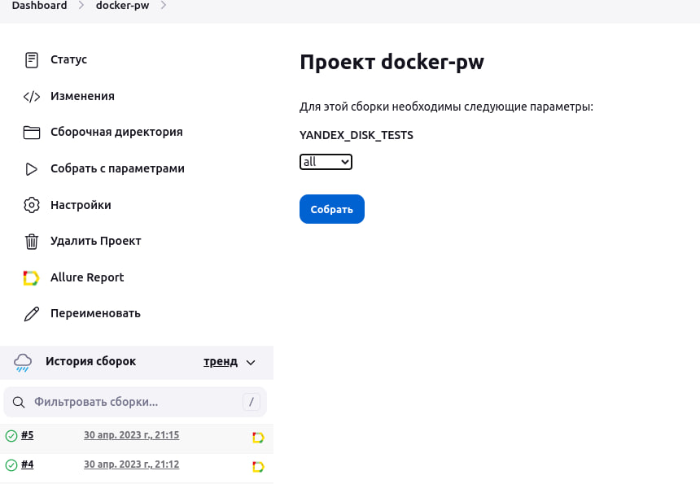
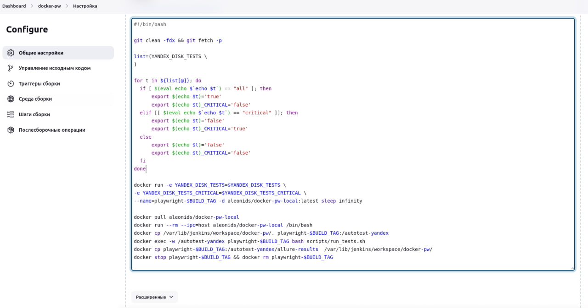

### Описание

Данный проект содержит пример использования Playwright для автоматизации тестирования Yandex.Disk.

- Доступы хранятся в файле .env.  
- Чтобы ускорить тесты и сделать их стабильнее, создание папки и создание файла реализовано отдельными тестами.  

- Авторизация проходит перед тестами. Данные передаются в тесты через `storageState.json`. Ускоряет прохождение, не нужно логиниться в каждом тесте.  
- В первом тесте создается папка в UI.  
- Во втором тесте создается папка по API (т.к. создание папки в UI проверяется в первом тесте) и в нее загружается файл (не во всех странах есть возможность создавать документы в яндекс диске, поэтому файл был загружен). Тесты независимые и запускаются одновременно. Если упадет создание папки, то проверка загрузки файла все равно запустится.
- Для возможности обхода капчи и скрытия режима headless использован `StealthPlugin` плагин.  
- Отчет о прохождении тестов формируется в таком виде:
  [https://aleonids.github.io/playwright-yandex-disk/index.html](https://aleonids.github.io/playwright-yandex-disk/index.html)  
- Для запуска тестов в Jenkins написан скрипт: [https://github.com/aleonids/playwright-yandex-disk/blob/master/scripts/run_tests.sh](https://github.com/aleonids/playwright-yandex-disk/blob/master/scripts/run_tests.sh). Можно запускать все тесты или, например, помеченные тегом @critical.  
- Настроен запуск тестов из Jenkins в подготовленном docker-образе, загруженном на docker hub.  
- В параметризованной сборке выбирается запустить все тесты или с тегом @critical:  

- Переменная c выбранными тестами передается из Jenkins в Docker-контейнер и скрипт run_tests.sh запускает нужные тесты. Скриншот с настройками Jenkins:  

### Установка

Для запуска проекта необходимо выполнить следующие шаги:  

Установить Node.js (версия 14 и выше);  

Склонировать репозиторий с помощью команды:  

`git clone https://github.com/aleonids/playwright-yandex-disk.git`

Перейти в папку с проектом и установить зависимости (команды для Linux)  
Запустив команды c помощью скрипта:  
`chmod +x scripts/install.sh`  
`sh scripts/install.sh`  

Или вручную:  
`npm init playwright@latest`  
`npm i -D dotenv`  
`npm install fs-extra`  
`npm i --save-dev @types/fs-extra`  
`npm install js-image-generator`  
`npm install playwright-extra`  
`npm install playwright-extra-plugin-stealth`  
`npm i -D allure-playwright`  
`npm i -D allure-commandline`  

### Запуск тестов

Для запуска тестов необходимо выполнить команду:  

`npm run test` - запуск всех тестов  
`npm run test-debug` - запуск всех тестов в режиме отладки  
`npm run test-critical` - запуск самых важных тестов с тегом @critical  

### Структура проекта

├── package.json  
├── package-lock.json  
├── README.md  
├── src/  
│&nbsp;&nbsp;&nbsp;&nbsp;&nbsp;├── pageObject/  
│&nbsp;&nbsp;&nbsp;&nbsp;&nbsp;│&nbsp;&nbsp;&nbsp;&nbsp;&nbsp;└── yandexDisk/  
│&nbsp;&nbsp;&nbsp;&nbsp;&nbsp;│&nbsp;&nbsp;&nbsp;&nbsp;&nbsp;&nbsp;&nbsp;&nbsp;&nbsp;&nbsp;&nbsp;├── api/  
│&nbsp;&nbsp;&nbsp;&nbsp;&nbsp;│&nbsp;&nbsp;&nbsp;&nbsp;&nbsp;&nbsp;&nbsp;&nbsp;&nbsp;&nbsp;&nbsp;│&nbsp;&nbsp;&nbsp;&nbsp;&nbsp;├── helpers.ts  
│&nbsp;&nbsp;&nbsp;&nbsp;&nbsp;│&nbsp;&nbsp;&nbsp;&nbsp;&nbsp;&nbsp;&nbsp;&nbsp;&nbsp;&nbsp;&nbsp;└── helpers.ts  
│&nbsp;&nbsp;&nbsp;&nbsp;&nbsp;├── tests/  
│&nbsp;&nbsp;&nbsp;&nbsp;&nbsp;│&nbsp;&nbsp;&nbsp;&nbsp;&nbsp;└── yandexDisk/  
│&nbsp;&nbsp;&nbsp;&nbsp;&nbsp;│&nbsp;&nbsp;&nbsp;&nbsp;&nbsp;&nbsp;&nbsp;&nbsp;&nbsp;&nbsp; └── yandexDisk.spec.ts  
│&nbsp;&nbsp;&nbsp;&nbsp;&nbsp;├── helpers.ts  
│&nbsp;&nbsp;&nbsp;&nbsp;&nbsp;└── core/  
│&nbsp;&nbsp;&nbsp;&nbsp;&nbsp;&nbsp;&nbsp;&nbsp;&nbsp;&nbsp;&nbsp;├── constants.ts  
│&nbsp;&nbsp;&nbsp;&nbsp;&nbsp;&nbsp;&nbsp;&nbsp;&nbsp;&nbsp;&nbsp;├── global-setup.ts  
│&nbsp;&nbsp;&nbsp;&nbsp;&nbsp;&nbsp;&nbsp;&nbsp;&nbsp;&nbsp;&nbsp;├── login.ts  
│&nbsp;&nbsp;&nbsp;&nbsp;&nbsp;&nbsp;&nbsp;&nbsp;&nbsp;&nbsp;&nbsp;└── types.ts  
├── scripts/  
│&nbsp;&nbsp;&nbsp;&nbsp;&nbsp;├── clear-report.sh  
│&nbsp;&nbsp;&nbsp;&nbsp;&nbsp;├── install.sh  
│&nbsp;&nbsp;&nbsp;&nbsp;&nbsp;└── run_tests.sh  
└── .env  

- `src/pageObject/yandexDisk/api/helpers.ts` - вспомогательные функции для работы с API Yandex.Disk;  
- `src/pageObject/yandexDisk/helpers.ts` - вспомогательные функции для работы с веб-страницей Yandex.Disk;  
- `src/pageObject/yandexDisk/index.ts` - объекты страниц и элементы страницы для Yandex.Disk;  
- `src/pageObject/index.ts` - общий объект страниц;  
- `src/tests/yandexDisk/yandexDisk.spec.ts` - тесты Yandex.Disk;  
- `.env` - доступы  
- `srs/core/global-setup.ts` - авторизация до запуска тестов. Данные передаются через `storageState.json`  
- `scripts/clear-report.sh` - скрипт для удаления папок с отчетами allure  
- `scripts/install.sh` - пеовоначальная установка playwright и всех зависимостей (перед запуском выполнить `chmod +x scripts/install.sh`)  
- `scripts/run-tests.sh` - скрипт для запуска тестов  
