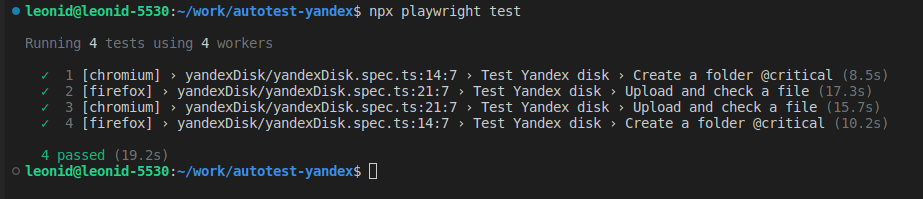
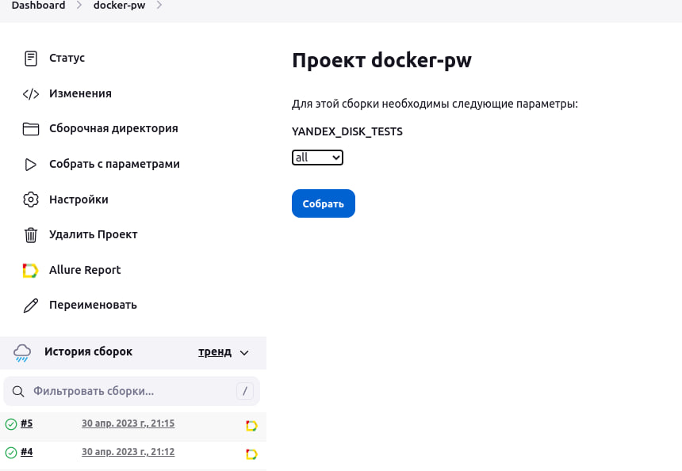
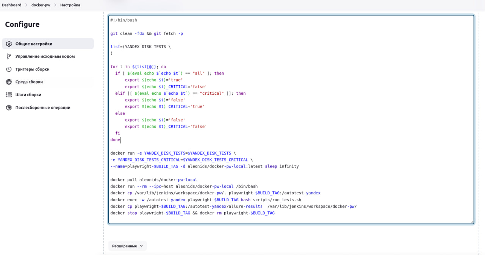

### Description

This project contains an example of using Playwright to automate testing of Yandex.Disk.
- Accesses are stored in the .env file.  
- To speed up tests and make them more stable, creating a folder and creating a file are implemented as separate tests.  

- Authorization occurs before the tests. Data is passed to the tests via storageState.json. This speeds up the process; there's no need to log in for each test.  
- The first test creates a folder in the UI.  
- The second test creates a folder via API (since folder creation in UI is verified in the first test) and uploads a file into it (not all countries have the capability to create documents on Yandex Disk, so a file was uploaded). The tests are independent and run simultaneously. If the folder creation fails, the file upload check will still execute.  
- To bypass CAPTCHA and hide the headless mode, the StealthPlugin plugin is used.  
- The test pass report is formatted as follows:
https://aleonids.github.io/playwright-yandex-disk/index.html  
- For running tests in Jenkins, a script is written: https://github.com/aleonids/playwright-yandex-disk/blob/master/scripts/run_tests.sh. All tests can be run or, for example, those marked with the @critical tag.  
- Configured test execution from Jenkins in a prepared Docker image uploaded to Docker Hub.  
- In the parameterized build, you can choose to run all tests or those tagged @critical:  

The variable with selected tests is passed from Jenkins to the Docker container, and the run_tests.sh script runs the necessary tests. Jenkins settings screenshot:  

### Installation

To run the project, you need to perform the following steps:

Install Node.js (version 14 and higher);

Clone the repository using the command:

`git clone https://github.com/aleonids/playwright-yandex-disk.git`

Go to the project folder and install dependencies (commands for Linux)  
Running commands using the script:  
`chmod +x scripts/install.sh`  
`sh scripts/install.sh`  

Or manually:  
`npm init playwright@latest`  
`npm i -D dotenv`  
`npm install fs-extra`  
`npm i --save-dev @types/fs-extra`  
`npm install js-image-generator`  
`npm install playwright-extra`  
`npm install playwright-extra-plugin-stealth`  
`npm i -D allure-playwright`  
`npm i -D allure-commandline`  

### Running Tests

To run the tests, execute the command:  

`npm run test` - uns all tests.  
`npm run test-debug` - runs all tests in debug mode.  
`npm run test-critical` - runs the most important tests with the tag @critical.  

### Project Structure

├── package.json  
├── package-lock.json  
├── README.md  
├── src/  
│&nbsp;&nbsp;&nbsp;&nbsp;&nbsp;├── pageObject/  
│&nbsp;&nbsp;&nbsp;&nbsp;&nbsp;│&nbsp;&nbsp;&nbsp;&nbsp;&nbsp;└── yandexDisk/  
│&nbsp;&nbsp;&nbsp;&nbsp;&nbsp;│&nbsp;&nbsp;&nbsp;&nbsp;&nbsp;&nbsp;&nbsp;&nbsp;&nbsp;&nbsp;&nbsp;├── api/  
│&nbsp;&nbsp;&nbsp;&nbsp;&nbsp;│&nbsp;&nbsp;&nbsp;&nbsp;&nbsp;&nbsp;&nbsp;&nbsp;&nbsp;&nbsp;&nbsp;│&nbsp;&nbsp;&nbsp;&nbsp;&nbsp;├── helpers.ts  
│&nbsp;&nbsp;&nbsp;&nbsp;&nbsp;│&nbsp;&nbsp;&nbsp;&nbsp;&nbsp;&nbsp;&nbsp;&nbsp;&nbsp;&nbsp;&nbsp;└── helpers.ts  
│&nbsp;&nbsp;&nbsp;&nbsp;&nbsp;├── tests/  
│&nbsp;&nbsp;&nbsp;&nbsp;&nbsp;│&nbsp;&nbsp;&nbsp;&nbsp;&nbsp;└── yandexDisk/  
│&nbsp;&nbsp;&nbsp;&nbsp;&nbsp;│&nbsp;&nbsp;&nbsp;&nbsp;&nbsp;&nbsp;&nbsp;&nbsp;&nbsp;&nbsp; └── yandexDisk.spec.ts  
│&nbsp;&nbsp;&nbsp;&nbsp;&nbsp;├── helpers.ts  
│&nbsp;&nbsp;&nbsp;&nbsp;&nbsp;└── core/  
│&nbsp;&nbsp;&nbsp;&nbsp;&nbsp;&nbsp;&nbsp;&nbsp;&nbsp;&nbsp;&nbsp;├── constants.ts  
│&nbsp;&nbsp;&nbsp;&nbsp;&nbsp;&nbsp;&nbsp;&nbsp;&nbsp;&nbsp;&nbsp;├── global-setup.ts  
│&nbsp;&nbsp;&nbsp;&nbsp;&nbsp;&nbsp;&nbsp;&nbsp;&nbsp;&nbsp;&nbsp;├── login.ts  
│&nbsp;&nbsp;&nbsp;&nbsp;&nbsp;&nbsp;&nbsp;&nbsp;&nbsp;&nbsp;&nbsp;└── types.ts  
├── scripts/  
│&nbsp;&nbsp;&nbsp;&nbsp;&nbsp;├── clear-report.sh  
│&nbsp;&nbsp;&nbsp;&nbsp;&nbsp;├── install.sh  
│&nbsp;&nbsp;&nbsp;&nbsp;&nbsp;└── run_tests.sh  
└── .env  

- `src/pageObject/yandexDisk/api/helpers.ts` - auxiliary functions for working with the Yandex.Disk API.  
- `src/pageObject/yandexDisk/helpers.ts` - auxiliary functions for working with the Yandex.Disk web page.  
- `src/pageObject/yandexDisk/index.ts` - page objects and page elements for Yandex.Disk.  
- `src/pageObject/index.ts` - common page object.  
- `src/tests/yandexDisk/yandexDisk.spec.ts` - Yandex.Disk tests.  
- `.env` - credentials.  
- `srs/core/global-setup.ts` - authorization before running tests. Data is passed through `storageState.json`  
- `scripts/clear-report.sh` - script to remove Allure report folders.  
- `scripts/install.sh` - initial installation script for Playwright and all its dependencies (run `chmod +x scripts/install.sh` before executing).  
- `scripts/run-tests.sh` - a script for running tests  
